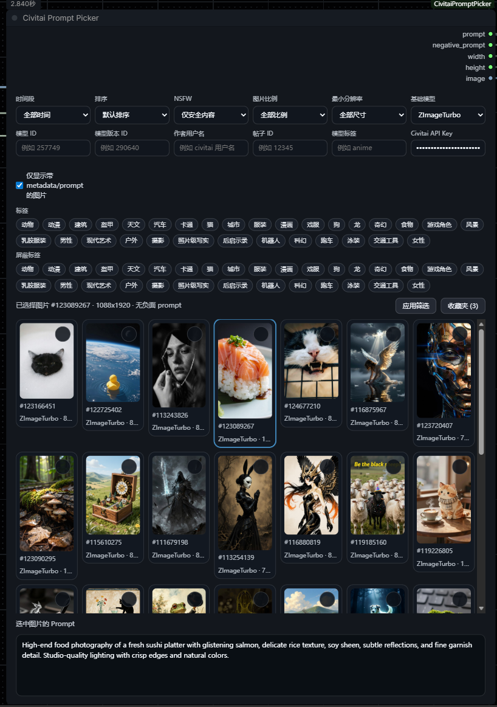
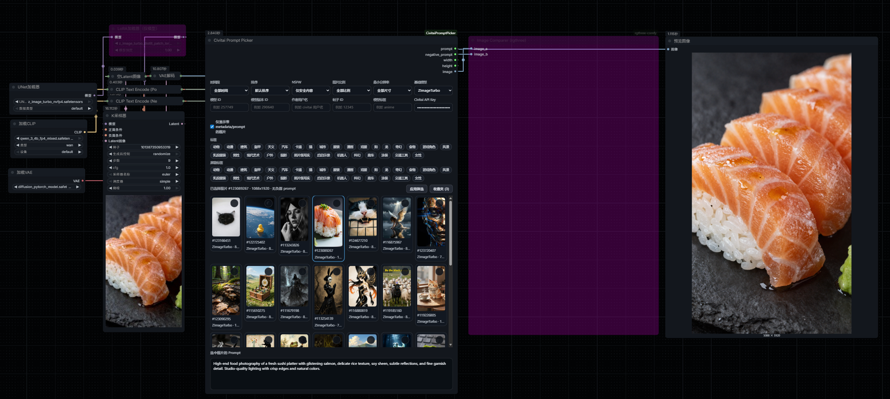

# ComfyUI Civitai Prompt Picker

ComfyUI custom node for browsing Civitai image prompts directly inside a node.

## Features

- Thumbnail browser embedded in the node UI
- Click image to output `prompt`, `negative_prompt`, `width`, and `height`
- Infinite scroll
- Filters for time range, sort order, NSFW, base model, model ID, model version ID, and metadata-only results
- Exact local NSFW filtering when Civitai upstream results are mixed
- Faster first-screen loading with background prefill

## Screenshots

### Node UI



### Workflow Preview



## Install

Clone this repository into your ComfyUI `custom_nodes` directory:

```bash
cd ComfyUI/custom_nodes
git clone https://github.com/Aca233/ComfyUI_CivitaiPromptPicker.git
```

Then restart ComfyUI.

## Usage

1. Add the `Civitai Prompt Picker` node in ComfyUI.
2. Browse thumbnails directly inside the node.
3. Click an image to output:
   - `prompt`
   - `negative_prompt`
   - `width`
   - `height`
4. Optional: paste your Civitai API key into the node's `Civitai API Key` field to access more complete results, including account-visible or NSFW content when your account is allowed to see them.

## Example Workflow

This plugin now includes a bundled example workflow:

- `workflows/civitai-prompt-picker-example.json`

You can drag that JSON file directly into ComfyUI to load the example graph.

## How to get a Civitai API Key

If you want more complete image results, open your Civitai account page here:

[https://civitai.com/user/account](https://civitai.com/user/account)

Then:

1. Sign in to your Civitai account.
2. Open the account page above.
3. Find the API key section on that page.
4. Create a new API key if you do not already have one.
5. Copy the key and paste it into the node's `Civitai API Key` input box.
6. Click `Apply filters` or refresh the node results.

Notes:

- The API key is optional, but it helps when some images are hidden unless you are logged in.
- NSFW results still depend on your Civitai account permissions and visibility settings.
- Keep your API key private and do not share it publicly.

## Node Outputs

- `prompt`
- `negative_prompt`
- `width`
- `height`
